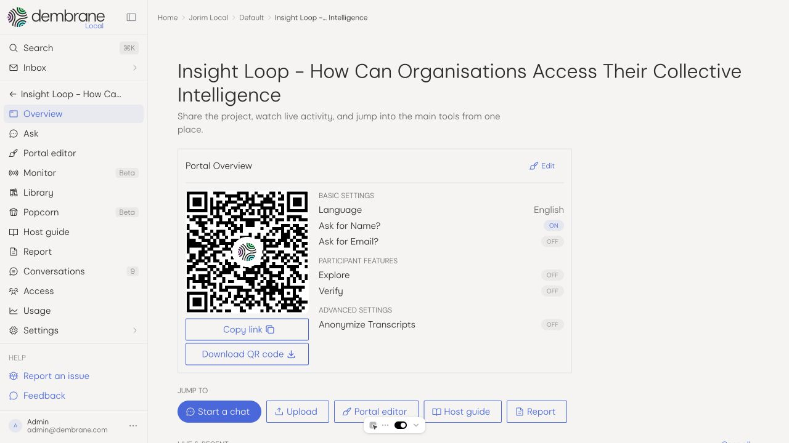
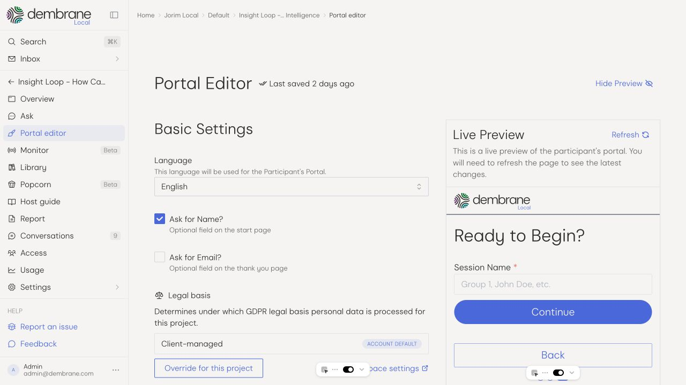
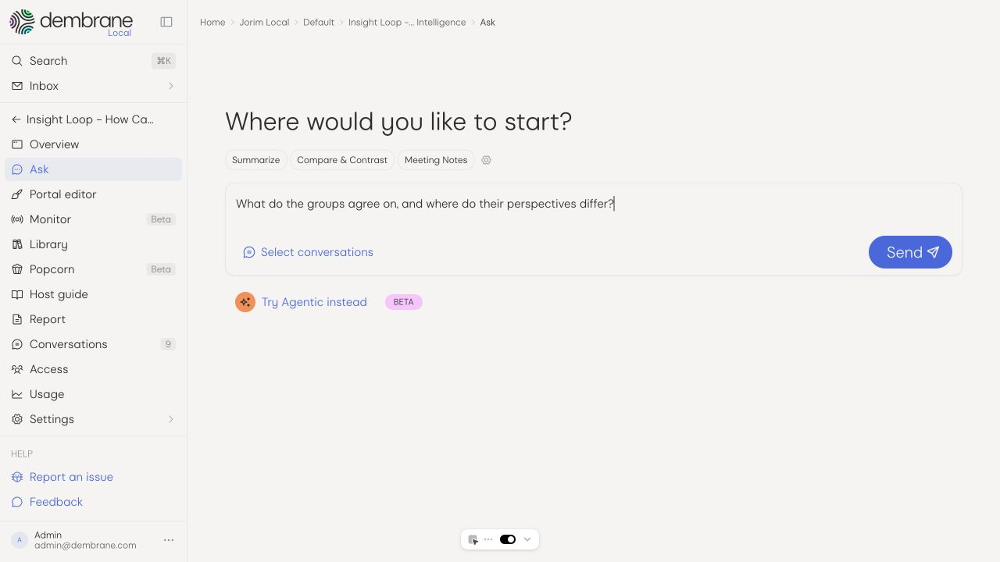
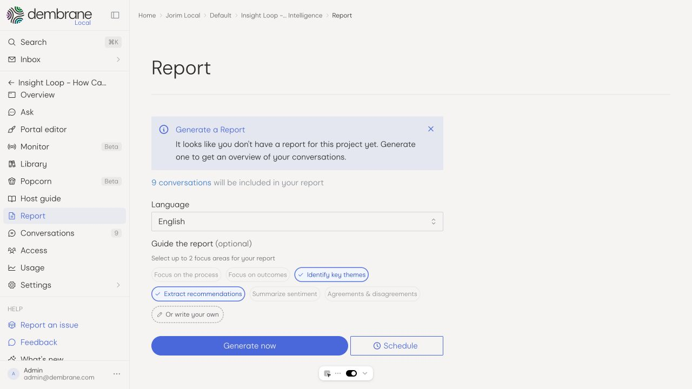

# dembrane

dembrane helps people make sense of big, messy conversations together. Participants record small-group discussions on their own phones, while hosts see what is emerging across the room. Transcripts, participant-verified insights, chat, and reports help turn those conversations into shared next steps while everyone is still there.

Built for workshops, citizen assemblies, strategy sessions, conferences, and other occasions where many people need to be heard. Read more on [dembrane.com](https://www.dembrane.com/).

[Try the platform](https://dashboard.dembrane.com/) · [Documentation](https://docs.dembrane.com/) · [Features](https://www.dembrane.com/platform/features) · [Trust center](https://www.dembrane.com/trust)

> dembrane was formerly called ECHO. The old name still appears in this repository's name, container images, and Kubernetes namespaces.

## How it works

1. *Prepare and share.* Create a project, configure the participant portal, and share its QR code or link.
2. *Start talking.* Participants join in a browser with no account or download required. Record several groups at once, work across languages, or upload existing recordings.
3. *Make sense together.* Follow incoming conversations in the dashboard. Enable Explore for questions that deepen the discussion and Verify so participants can critique, refine, and approve what the language model surfaces.
4. *Bring the results back.* Ask questions across conversations, check the cited sources, and create reports that capture themes, differences, and recommendations. Review the results with the people involved.

See the [feature overview](https://www.dembrane.com/platform/features) and [quick start for hosts](docs/users/host/getting-started.md).

## Inside the app

These screenshots show the local development app. Available features and navigation can differ from the hosted release. Select an image to view it at full size.

<table>
  <tr>
    <td align="center" width="50%">
      
       
      <em>Share a project by QR code or link</em>
    </td>
    <td align="center" width="50%">
      
       
      <em>Configure and preview the participant portal</em>
    </td>
  </tr>
  <tr>
    <td align="center" width="50%">
      
       
      <em>Start an analysis with your own question</em>
    </td>
    <td align="center" width="50%">
      
       
      <em>Choose the language and focus of a report</em>
    </td>
  </tr>
</table>

## What you can do

- *Listen across groups and languages.* Capture parallel conversations through the participant portal, transcribe them, and review their summaries and source transcripts.
- *Keep participants involved.* Explore and Verify let people question and improve the interpretation of their own conversation.
- *Ask questions of the whole project.* Compare perspectives, find recurring concerns, and follow citations back to the source. Agentic chat can search and read conversations in several steps.
- *Create and share reports.* Review a draft, share it by link, or download a PDF.
- *Work together.* Organise projects in workspaces, invite collaborators, and control access through roles and permissions.
- *Build on your data.* Export material and connect other systems through the API and webhooks.

The [feature catalogue](docs/features/index.md) covers capabilities and availability in more detail.

## Trust and security

The [dembrane trust center](https://www.dembrane.com/trust) describes the managed service's EU hosting and processing, ISO 27001 certification, encryption at rest, and data protection practices. Client data is not used for model training unless the client opts in. Hosts determine the legal basis for their sessions, and participant identity collection is configurable.

These commitments describe the managed service. For your own deployment, review the [self-hosting guide](docs/users/developer-external/self-hosting.md) and [provider configuration](docs/users/developer-external/configuration-and-llm-providers.md).

Please report vulnerabilities through our [security policy](SECURITY.md).

## Getting started

- *Use the hosted platform:* [open the dashboard](https://dashboard.dembrane.com/) and follow the [host guide](docs/users/host/getting-started.md).
- *Run an event with us:* dembrane offers event services, facilitator training, and scholarships. See [services and pricing](https://www.dembrane.com/pricing) for the current options.
- *Run or develop it yourself:* start with [self-hosting](docs/users/developer-external/self-hosting.md), the [local development setup](echo/readme.md), and the [architecture guide](docs/users/developer-internal/architecture.md).

The codebase includes the React dashboard and participant portal, a FastAPI backend, an agent service, and Directus configuration. PostgreSQL, Redis, background workers, and S3-compatible storage support the processing pipeline.

## Documentation

- [Published documentation](https://docs.dembrane.com/) and its [source](docs/README.md)
- [For hosts](docs/users/host/index.md) and [participants](docs/users/participant/index.md)
- [For developers and integrations](docs/users/developer-external/index.md)
- [Local development setup](echo/readme.md)
- [Contributing](CONTRIBUTING.md)

## Project status and license

dembrane is actively maintained by Dembrane B.V. and welcomes community contributions. We build the platform so more people can help shape the decisions that affect them. Meet the team and read about our approach on the [about page](https://www.dembrane.com/about).

This repository is *source available* under the [Business Source License 1.1](LICENSE). The license permits non-production use and includes a production-use grant for organisations whose Total Finances do not exceed EUR 1,000,000 over the most recent 12-month period. Each release has a Change Date three years after release and a Change License of GPLv3. See [LICENSE](LICENSE) for the full definitions and conditions, or contact [jorim@dembrane.com](mailto:jorim@dembrane.com) for alternative licensing arrangements.

We welcome forks and contributions under those terms. If you would like to collaborate or discuss a maintainer role, get in touch.

## Stewardship

dembrane is currently independent and working towards becoming steward-owned. Community members interested in helping guide the project's future can contact [bram@dembrane.com](mailto:bram@dembrane.com).

## Contact

- Platform support: [support@dembrane.com](mailto:support@dembrane.com)
- Events, hosting, and partnerships: [evelien@dembrane.com](mailto:evelien@dembrane.com)
- Urgent pull requests: [sameer@dembrane.com](mailto:sameer@dembrane.com)
- Legal inquiries and stewardship: [bram@dembrane.com](mailto:bram@dembrane.com)
- Mission, press, and licensing: [jorim@dembrane.com](mailto:jorim@dembrane.com)

Thanks to everyone who has contributed to dembrane!

