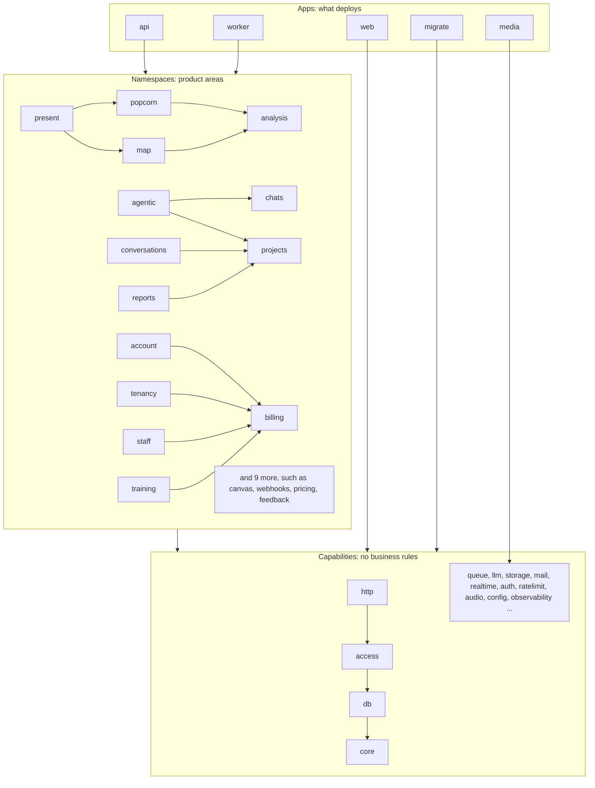

# dembrane platform

The Bun backend for dembrane: five programs that deploy, built from the libraries in `packages/`.

## Run it

```sh
bun run setup        # Postgres in docker, dependencies, migrations
bun run dev          # API on :8080
bun --env-file=.env.local apps/worker/src/main.ts   # worker
bun run check        # lint, types, the layer rule, tests
```

## Apps and packages

`apps/` holds the programs that deploy and run. Each has a `src/main.ts` that reads config, wires the packages together and starts.

- **api**: the HTTP server. Every namespace's routes are mounted in `apps/api/src/app.ts`.
- **worker**: runs queued jobs and schedules (the audio pipeline, analysis, reports, emails, billing timers).
- **media**: the ffmpeg service (below).
- **web**: serves the built dashboard and participant portal, and proxies `/api` to the API.
- **migrate**: runs before every rollout: schema migrations, the queue schema, database grants.

`packages/` holds libraries. A package never runs on its own; an app composes it.

## What media is, and why it is its own app

media is an ffmpeg service. It probes, converts, splits and merges audio and does nothing else: it has no database, no bucket credentials and no secrets, because callers hand it presigned URLs to read from and write to. It runs apart from the API and the worker because audio conversion is CPU-heavy native work. Cloud Run scales it from 0 to 10 instances, each running one conversion at a time, and a crash or an out-of-memory kills that one conversion, not the API or the worker. The worker's audio pipeline calls it over HTTP, and so does the API for an upload's duration and for merged audio downloads. The ffmpeg code itself lives in `packages/audio`; `apps/media` is only its HTTP shell. Locally, with no `MEDIA_URL`, the same code runs ffmpeg inside the calling process.

## The layers

Three layers, top to bottom. A dependency points down only.

1. **Apps** may import anything.
2. **Namespaces** are product areas: projects, conversations, chats, account, popcorn and so on. Each owns its routes, jobs, storage and business rules. A namespace imports capabilities. It imports another namespace only when its `package.json` lists that namespace under `dembrane.allow` with a reason; the list is at the end of this file and shows where the lines are still blurred.
3. **Capabilities** are building blocks with no business rules: config, db, core, auth, access, queue, storage, llm, mail and so on. A capability never imports a namespace or an app.

`bun run packages check` enforces this in CI (it is part of `bun run check`). Each package states its layer and a one-line description in its `package.json`; the list in [PACKAGES.md](PACKAGES.md) is generated from those and from the imports.



The diagram draws the main arrows between namespaces; the full list of allowed ones is in [PACKAGES.md](PACKAGES.md). Every namespace uses the capabilities.

## Where to start reading

- **Add a route.** Open a small namespace such as `packages/webhooks/src`: `routes.ts` returns a Hono router, its handlers call `service.ts`, which calls `storage.ts`. Check the caller with `projectFor` from `@dembrane/http`. The API mounts the router in `apps/api/src/app.ts`.
- **Add a background job.** Define it with `defineJob` in the namespace's `jobs.ts` (see `packages/webhooks/src/jobs.ts`). Add it to the list the API starts in `apps/api/src/main.ts` so it can be enqueued, and register its handler in `registrations` in `apps/worker/src/jobs.ts`. Services enqueue through a `JobSink` from `@dembrane/queue`.
- **Add a config key.** Declare it in `packages/config/src/schema.ts` with `key(ENV_NAME, schema, { description })`, override it per environment in `packages/config/environments/*.ts`, and read it as `config.<section>.<key>`. `bun run config check` fails when a key is declared but never read.

A new package needs `description` and `dembrane.layer` in its `package.json`; then run `bun run packages write` to refresh [PACKAGES.md](PACKAGES.md).

## Packages

Every app and package with its one-line description, what uses it and the imports allowed between namespaces: [PACKAGES.md](PACKAGES.md).
