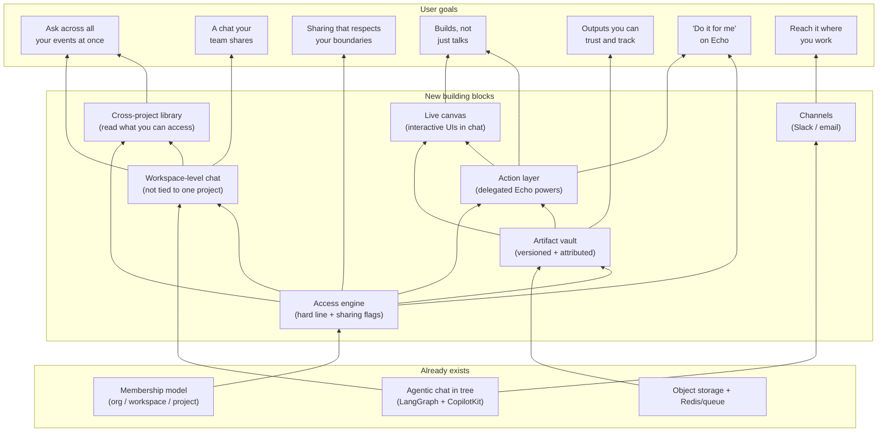

# Agentic chat: goals in user terms + dependency map

Companion to `agentic-vfs-design.md` (that one is the technical version). This one is for feedback on **what we're trying to give users** and **what depends on what**.

## What we're enabling (user terms)

Echo users are hosts and researchers running workshops, consultations, and civic forums. Here is what each goal means for them, in plain language.

| # | Goal | What it enables for the user | Today |
|---|------|------------------------------|-------|
| G1 | **Ask across all your events at once** | One assistant that reasons across every project you can access, because a real event often spans several projects. | Chat is locked to a single project. |
| G2 | **A chat your whole team shares** | The conversation lives with the workspace, not one person. Teammates can read it and pick up where you left off. | Chat is private to its creator. |
| G3 | **Sharing that respects your boundaries** | The assistant never sees anything you can't. Across teams/orgs it only combines data when sharing is allowed; a private workspace stays private. | Owner-only; no cross-scope concept. |
| G4 | **An assistant that builds, not just talks** | It can generate a live, interactive view right in the chat (a custom chart, a filter, a report widget) that you can click, not just read. | Text answers only. |
| G5 | **Outputs you can trust and track** | Reports and tools it makes are versioned and attributed: what changed, who changed it, when. Re-run and schedule them. | No history/attribution on generated output. |
| G6 | **"Do it for me" on Echo** | Within your permissions, it takes real actions: adjust portal/editor settings, create or schedule a report, using Echo's existing capabilities. | Read-only; it can't act. |
| G7 | **Reach it where you work** | Native chat now; Slack and email later, same assistant. | Native chat only. |

## The building blocks (plain names)

These are the pieces we'd build. Each unlocks one or more goals above.

- **Access engine** - one rule for who can see and do what. Hard line: only what you can access. Soft line: cross-team/org sharing only when flags allow.
- **Workspace-level chat** - the chat is no longer tied to one project; it belongs to a shared scope.
- **Cross-project library** - the assistant can read across everything you're allowed to see (and later Slack/Drive/Gmail).
- **Artifact vault** - a versioned, attributed store for the things it makes (reports, tools), structured like Echo itself (org -> workspace -> project).
- **Action layer** - the assistant safely uses Echo's own powers on your behalf, with a per-session grant that never exceeds your permissions.
- **Live canvas** - interactive UIs rendered inside the chat, edited by the assistant through the vault and reacting live.
- **Channels** - Slack/email entry points to the same assistant.

## Dependency map

Arrows mean **"is required for / enables"**. Bottom = what already exists, middle = new building blocks, top = user goals. Use this to push back: anything mis-prioritised, missing, or that you'd cut.

## How to read it for prioritisation

- **The Access engine (B1) is the spine.** Almost everything hangs off it; it is also the riskiest (security). Likely first real build.
- **Two independent tracks after that:**
  - *Reach + collaboration* track: Workspace-level chat (B2) -> Cross-project library (B3) -> Channels (B7). Delivers G1, G2, G7. Lower risk, fast user value.
  - *Build + act* track: Artifact vault (B4) -> Action layer (B5) -> Live canvas (B6). Delivers G4, G5, G6. Higher value, higher risk (delegated execution + running generated code).
- **G3 (boundaries) comes "for free" with B1** and should ship with it.
- You could ship the whole left track and pause before the right track, or vice-versa. That's the main fork to react to.

## Suggested order (smallest valuable steps first)

1. Land current chat + **Access engine** (unlocks G3, sets the spine).
2. **Workspace-level chat** + **Cross-project library** (unlocks G1, G2). - the "better chat" most users feel first.
3. **Artifact vault** (unlocks G5).
4. **Action layer** then **Live canvas** (unlocks G6, G4). - the headline, gated behind the most review.
5. **Channels** (unlocks G7) whenever it fits.
