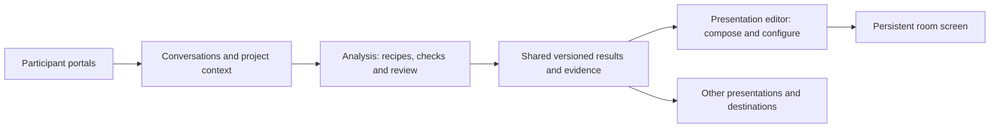

# Project navigation, Analysis and Present

Status: revised product specification following host feedback, navigation review and a source-checked pressure test. This document defines intended behavior, not a claim that the current code already supports it. Implementation is separate work. The project hierarchy, ownership of each area and original-to-translation playback are settled where stated; rollout, renderer integration, language fallback and animation timing have explicit proposals or validation gates below.

## Product intent

Treat the participant portal and the in-room monitor screen as first-class project experiences, each with its own editor. Analysis is the processing workspace that connects collected material to useful results. Present is the home of presentations and their editor.

- *Portal editor*: configure how participants enter, understand and contribute to a session.
- *Analysis*: configure recipes, run processing, inspect evidence and shape the shared data pool.
- *Present*: open the room's screen immediately, or use the presentation editor to compose and configure it.

Popcorn remains the name of the short-phrase experience. Present supports four initial data-driven tools: Popcorn, Stakeholders, Tensions and Map. These are components a host can put in a presentation. Their recipes and shared results have a home in Analysis without requiring four matching pairs of tool pages.

A host can open Present and start presenting with no configuration: Popcorn only, with all popcorns translated to the project language. Each popcorn appears in its original language immediately and animates to its translation when available, with enough time to read both. The screen's interface uses the project language. Choosing tools or languages is optional. Understanding recipes, verification steps or analysis history is never a prerequisite.

The room screen is a persistent destination that can remain open through an event, independent of the host's current dashboard page or processing jobs. It can show a welcome, explain data processing, display Popcorn during discussion or a break, and show Tensions or Map later. Call it the *room screen* in product copy. Monitor remains the host's operational view, with its existing live funnel, QR functions and `ENABLE_MONITOR` gate. The proposed review queues extend that host role; they are not audience screens.

Analysis and Present describe workspaces, not modes hosts must keep switching between. Analysis can happen during an event; presentations can also be used afterwards or embedded elsewhere.

## Navigation and naming

The following entries sit directly under the project name, in this order. Blank space separates related work without imposing chronological stages. Conversations remains top-level: the host reports it is the third most visited screen after Ask and Overview. Frequency of use takes priority over nesting every source-related action under Analysis.

```text
Project name
├── Overview
├── Ask
├── Conversations
│
├── Portal editor
├── Monitor
├── Present
│
├── Analysis
├── Report
├── Automation
│
└── Manage
```

These are stable destinations, subject to existing access and rollout rules. Their child views are local tabs, editor sections or detail pages, not a permanently expanded sidebar. Actions such as *Generate report*, *Present* and *Run again* are buttons within their destination, not competing navigation entries.

| Project entry | Landing and local hierarchy | Responsibility |
|---|---|---|
| Overview | Project summary and Project setup | Goal, context, methodology, applicable assistant guidance and readiness; links to work needing attention |
| Ask | Project-scoped conversation with the assistant | Ask about the current project with its scope visible |
| Conversations | Conversation list → recording, transcript and source detail; upload action | Canonical home of collected material and source inspection |
| Portal editor | Default portal editor → Intro, Consent, Behaviour | Configure the participant experience; a portal collection precedes the editor when multiple portals are supported |
| Monitor | Activity landing → Moderation and Fact check review queues | Follow participation, recording health and issues requiring host attention |
| Present | Default presentation → Present or Edit presentation | Configure the audience experience in one editor: Intro, Data policy and Activities, alongside preview and screen settings |
| Analysis | Results → Recipes → Runs | Inspect and shape shared findings, configure their production and inspect processing history |
| Report | Existing reports → selected report; Generate report action | Create and revisit reports without burying previous work behind a creation flow |
| Automation | Workflows → workflow detail; project connections and delivery history | Configure when work runs and where its output goes |
| Manage | Access overview, Project usage, Export and Admin | Permissions, resource use, one-off downloads and project administration |

Hide Library from project navigation for now. Hiding it must not delete its contents, remove permissions or break saved links. Map is available in Analysis results and as a Present block; it is no longer a separate top-level tool in this hierarchy. Keep existing Map deep links functional. Move Host guide discovery into contextual help on Overview, Portal editor and Monitor, while retaining its direct route. Preserve Canvas access and existing feature gates.

Present lands on the default presentation with a prominent *Present* action and an *Edit presentation* action. Analysis lands on Results, with Recipes and Runs next in that order. Filters or recipe-specific detail views may name Popcorn, Stakeholders, Tensions or Map, but the two tabs must not be mirrored tool menus.

Use *Map* consistently in product navigation and copy. Its current data can still consist of arguments. Calling it Map avoids promising formal attack/support vectors or other argumentation semantics that the view does not provide. Proximity and tree edges must not be described as support, attack or logical entailment. Keep consolidation within the relevant recipe and result inspection, rather than adding a separate presentation tool.

Recipes have an explicit home in Analysis. A recipe describes processing, its inputs, instructions, checks and outputs. Analysis exposes these through understandable defaults and progressive disclosure. This replaces both a separate top-level Recipes tab and the previous draft's paired Analysis/Present tool navigation.

### Scope above the project

Retain the existing organisation, workspace and account hierarchy. This proposal reorganizes project work; it does not flatten administration into one settings menu or require a redesign of those existing screens.

| Scope | Existing destinations to preserve |
|---|---|
| Global and personal | Search, Inbox, Help, account menu and organisation/workspace switching; eventual global Ask |
| Organisation | Overview, Members, Training, Settings and Workspaces; organisation settings retain General, Usage, Billing and MCP access under existing role gates |
| Workspace | Overview and project list, New project action, Members, Settings and pinned projects; settings retain General, usage/billing, training status and lifecycle controls where currently available |
| Project | The project menu above, with its project name and workspace context visible |
| Account settings | Account and security, My access, Appearance and Assistant |
| Staff administration | Existing staff-only tools and permissions; no exposure through project Manage |

Ask can eventually gain a global entry point, but the project-level Ask shortcut stays. Entering it from a project starts or resumes work in that project's scope. Make scope explicit, and require an intentional scope change before including other projects. A global entry point does not imply new cross-project data access. Implementing global Ask is separate from this navigation migration.

Maintain current permission distinctions for observers, external members, workspace administrators, organisation administrators, billing roles and staff. Moving a link cannot grant access or make a previously available capability unreachable for an authorized host.

### Project setup, operations and administration

Overview gives a project its purpose as well as its status. Put goal, context, methodology and applicable assistant guidance in an accessible *Project setup* section. Show the effective settings, where they come from and which overrides the host can edit. Preserve actual inheritance and precedence behavior; do not invent a Personal → Workspace → Project rule simply to fit the menu. Changing project guidance must state which future work it affects and must not silently rerun analysis.

Conversations owns recordings, transcripts, uploads and source details. Analysis selects from and links back to that collection, with evidence links preserving conversation and relevant passage. Do not create a second Sources collection under Analysis. Monitor and Ask also link to the same source detail pages.

Monitor opens one operational view combining activity, participation, recording health and attention items. Use *Activity* rather than the internal-sounding *Trace*. Moderation and Fact check are filtered review queues with links into the relevant source or shared result. Reuse the canonical review actions and history; do not create another editable copy of findings or a second checking engine. Existing Monitor functions remain available; queue definitions, permissions and processing behavior are new implementation contracts. Merely opening a queue must not start model-backed checks.

Portal editor follows the same experience-editor principle as Present. Intro, Consent and Behaviour are sections of the selected portal's editor. Opening the default portal should not require creating or naming one. A future collection of portals adds selection before the editor, without forcing that extra step for a single default portal. Participant consent and audience-facing Data policy explain related rules to different audiences; both must remain consistent with actual project policy, and neither editor silently changes the other.

Report lands on existing reports with a prominent *Generate report* action and useful empty-state guidance. Generation settings belong to that action's flow. Report remains a distinct destination for report documents; it does not duplicate the Analysis result browser. Preserve existing report inputs and provenance rather than silently changing its producer as part of a navigation move.

Manage contains access overview, project usage, one-off export and administrative controls such as Move, Clone and Delete. Keep everyday project framing on Overview. Keep organisation credentials and workspace policies at their existing scope, with contextual links from Manage where needed. Project connection configuration has one home in Automation; Manage may expose the permissions controlling who can configure or activate it.

### Recipes and automation

A recipe defines *how findings are produced*: inputs, processing steps, checks and outputs. A workflow defines *when work happens and what follows*: a trigger, a reference to an existing recipe or supported operation, and an optional delivery destination. Workflow configuration links to the Analysis recipe editor instead of duplicating it. Analysis owns processing runs; Automation shows workflow executions and delivery history with links to those runs.

Automation owns project-specific workflow configuration and connection bindings. Credentials and organisation-wide integration permissions stay at their existing administrative scope. Manage's *Export* creates a one-off download; scheduled or event-driven exports belong in Automation. Saving a workflow or choosing a destination must not silently activate processing or external delivery. Activation is explicit, respects existing authorization and identifies the destination and data scope.

This is the agreed information architecture for automation, not a claim that a general workflow engine exists. Supported triggers, operations, retries, delivery contracts and their rollout need separate implementation definition. Preserve current integrations and webhooks during migration. Existing optional live Popcorn remains available in Present and uses the shared processing lifecycle; it must not require visiting Automation first.

### Depth without repeated navigation

In the presentation editor, selecting a block exposes its display settings and a compact *Data and processing* section: which results it uses, their readiness and any issue needing attention. The panel offers one processing action appropriate to the state: *Prepare* when missing, *Update results* when stale, or *Try again* after a failure. These use the same processing service as Analysis.

Opening a result's evidence or correcting one item uses a contextual Analysis panel within the editor. This panel reuses Analysis's inspection/editing components, permissions and mutations. It states when a change affects shared results and other presentations. Closing it returns to the same block, preview position and unsaved editor state. This is access to the shared analysis workspace in context, not a second editor for copied data.

Full recipe configuration, source-scope changes, run comparisons and extensive result review have their home in Analysis. *Open in Analysis* preserves the relevant recipe, result and source scope and provides a return path. Hosts can do the default flow and a routine correction without tab-hopping; deeper work has a dedicated workspace. These controls are never exposed on the audience screen.

## The shared data pool

The project has one pool of source-grounded, versioned results. Its types include short phrases, stakeholders, stakeholder relationships, tensions and arguments. Tools can have different dependencies and source coverage. A shared pool does not mean every tool runs the same prompt or must be generated together.



Presentation settings reference result revisions and store display choices separately. Two renderings of a finding refer to the same finding. A presentation never maintains a second independently editable copy of the analysis.

Sources, evidence, analysis results, presentation settings and translated text have distinct responsibilities. Translation may require background processing, but choosing a display language must not rerun extraction or change original results.

A presentation is its own saved object with a stable identity, content sequence, settings, result bindings and access configuration. Its life is independent of a recipe execution. Several presentations can consume the same results while having different languages, selections and audiences. Stopping processing, closing the host dashboard or finishing an event does not delete the screen or its link.

## Boundary between the tabs

| Host action | Home | Effect |
|---|---|---|
| Choose the tools beside the always-present opening Popcorn | Present | Changes this presentation |
| Choose screen language or translate displayed results | Present | Changes this presentation; keeps originals |
| Change title, introduction, frame, QR code, attribution or branding | Present | Changes this presentation, within existing access and plan rules |
| Filter to a time range, focus an item, adjust playback or hide an item from this screen | Present | Selects what this presentation shows |
| Choose which conversations an analysis considers | Analysis | Changes analysis inputs and potentially its results |
| Change source scope, the existing Popcorn voice note/presets or a recipe's declared bounded parameters | Analysis | Configures future processing; built-in prompt and check definitions remain versioned code |
| Refresh, rerun, retry, verify or consolidate results | Analysis; routine processing actions can be reached in context | Performs analysis work through the same service |
| Correct wording, relationships or other supported result fields | Analysis, including its contextual editor panel | Creates a new shared result revision |
| Exclude an incorrect finding from current results | Analysis | Withdraws it from the current pool, with history retained |
| Inspect evidence, provenance, changes and run history | Analysis | Explains where results came from |
| Open the audience screen or manage its public link | Present | Displays or shares the selected presentation |

Evidence that helps a room understand a finding can also appear in its presentation. Analysis adds the deeper review and editing controls. Presentation controls never edit source evidence or change a finding's verification status.

Make the scope of change visible at the action: *Hide from this presentation* is reversible presentation curation; *Edit shared result* and *Exclude from results* affect the shared pool and its consumers; *Change project instructions* affects applicable future project processing. Show affected consumers or scope before committing shared changes. Hiding every visible item produces an explicit empty preview with a reset action. Persistent per-item hiding and shared exclusion require implementation: today's server tab-hiding mechanism is not either of those capabilities.

## Present: the host's flow

### Start with defaults

The default presentation contains only Popcorn, playing across conversations in shuffle order. Its screen language and result-language policy are *Project language*, resolved to a concrete target using the rules below. Translate all popcorns to that target, including newly arriving phrases and phrases originally spoken in another language. Preserve original wording and evidence in the pool. Display the original immediately, then animate to the translation. When original and target text match, show one language state without a redundant transition.

The host does not have to select Popcorn, choose a language, name a presentation or enter the editor before pressing *Present*. Derive a default title from the project. Existing saved presentations retain explicit language and content choices; unset choices use the new defaults.

Store *Project language* as a policy, not a one-time copy. Resolve it when preparing or opening the screen. A change of project language changes the required target and reuses that target's cached texts where available; an already-open screen switches its target coherently without attaching old-target translations to the new setting. An explicit presentation-language override remains independent. The host dashboard's own interface language is separate from the audience language.

#### Resolving a concrete language

The Directus field's choices currently list `en`, `nl` and `multi`, and the field permits null. This is metadata on a string field, not a database enum restricting persisted values to those three. The portal editor already accepts `en`, `nl`, `de`, `fr`, `es`, `it`, `uk` and `cs`. Do not narrow that existing support or treat `multi` as a translation target.

Proposed deterministic resolution, shown in the editor before presenting:

| Stored choice | Effective presentation language |
|---|---|
| Explicit supported presentation override | That override, unchanged by the project language |
| Follow project, with a supported concrete project code | That code; normalize supported locale forms such as `de-DE` to `de` |
| Follow project, with `multi` | English fallback; label “English · multilingual project” and offer the existing language selector |
| Follow project, with null, blank or unsupported code | English fallback; label “English · project language not set” and offer the selector |

English is a proposed fallback, chosen to keep a first screen possible without a mandatory setup question and to match existing fallback behavior. It is not inferred from the host's browser and does not rewrite the project's language. A host can choose any of the eight supported targets for this presentation. Changing language policy triggers translation work for the existing results, not extraction.

Align the Directus choice metadata and API validation with supported concrete codes while preserving legacy `multi` and null values. Audit readers of the project field before changing metadata; use the repository migration workflow. Result-translation support is distinct from audience UI localization: the current deck's UI and data explainer have English/Dutch copy with fallbacks. Complete and verify audience copy for all eight supported targets before promising the entire screen in those languages.

### Presentation editor

Make the audience preview the main surface, with the established underlined result tabs at the top and a separate compact toolbar for pause/resume and fullscreen. Introduction and Data policy remain directly accessible on the audience screen, including before results exist. Keep editor controls beside it on wide screens and responsive at smaller widths, following the Portal editor's established form patterns. Adapt that layout for a wide room screen. It is an editor for an ongoing interactive screen, not necessarily a linear slide deck.

Intro, Data policy and Tabs are content sections of this one editor, not separate settings pages or additional sidebar destinations. Intro holds welcome and introductory content; Data policy holds the audience-facing processing explanation and required disclosures; Tabs holds Popcorn, Tensions, Map and Stakeholders. Keep the audience preview and unsaved editor state when moving between sections. These sections organize authoring without forcing every section to appear on the room screen or imposing a fixed event sequence.

Offer Popcorn, Stakeholders, Tensions and Map as the four initial data-driven blocks. The host enables or disables Tensions, Map and Stakeholders. Popcorn is always selected and is always the opening tab, because it is where the screen absorbs latency: it has content while the other blocks are still being made. Normalize saved settings and incoming changes to that rule rather than refusing them. Always order selected tabs by recipe complexity: Popcorn, Tensions, Map, Stakeholders. This is a fixed product order, not measured runtime latency. Do not show rearrangement controls; normalize previously saved orders as well. Keep all four discoverable even when their results are not ready. Introduction slides and the existing data-processing explainer are supporting content blocks, not additional analysis tools. Keep them optional in the default Popcorn-only screen, except for existing required disclosures.

Reuse the shared autosave hook and save-status component. Persist settings as a host-only draft, preview that draft, and expose one Publish changes action. Draft autosaves must not alter the room screen, public links or trigger processing. Publishing applies the saved draft to audience views; reject stale revisions. Do not add per-box save buttons. Analysis result revisions remain explicit publication actions, and result lists reuse the Conversations row component rather than introducing a new table style.

Common settings appear once: title, screen language, result language, introduction and frame, QR code, attribution, branding, and sharing. Tool-specific controls appear with their tool. Show the primary choices first; use progressive disclosure for less common display settings.

Keep participant names off by default and preserve existing restrictions on branding and synthetic-demo disclosures. Opening a presenter view does not enable a public link. Sharing remains a separate, explicit choice.

### Prepare and present

Distinguish *opening the Present tab* from *pressing the Present button*. Opening the tab creates the default presentation if needed and starts no extraction or scheduled processing. An empty project opens the full editor immediately. New presentations include an introduction using the project title and the project-derived data-processing explanation. Pressing Present opens the published audience destination without starting processing. A host-only preview uses the same content, settings and result bindings.

Introduction and data-processing content can be configured, published and presented before any recordings or results exist, with Popcorn still waiting for its first phrase and every other result tab disabled. Result tabs use waiting states until content arrives. Go live starts the timed live processing session independently of opening the screen and may be enabled before the first recording. Share exposes the published viewer link and access settings. Sharing changes follow the same autosave and Publish changes boundary as the rest of the presentation.

Preparation uses saved project recipe configuration or built-in defaults, and creates the same runs visible in Analysis. Reuse suitable ready results and compatible work already in progress. Preparing one presentation must not generate unselected tools or regenerate results merely because another presentation uses them. Loading the editor, selecting a block or previewing existing content never starts extraction by itself. An optional *Prepare* action lets the host get results ready before opening the screen.

Once a selected block is usable, the host can show it while others prepare. Unready blocks show a simple audience waiting state when opened; technical errors and retry controls stay with the host. Result readiness must not gate opening the persistent room screen or showing introductory content.

Default preparation is a convenience entry point to Analysis's processing. Deeper work is available through the contextual panel or full Analysis workspace. *Use latest results* only adopts existing ready results; it never starts a model run.

Do not present a toolbar of processing verbs. Present, Go live and Share form a prominent action group. Keep Edit presentation and Publish changes in the editing controls below it. The processing panel exposes only its current state action. *Use latest results* appears only when a completed replacement is available. *Go live* is optional, with the existing duration choices. *Run again* is an advanced Analysis action mapped to regeneration. Refresh, regenerate and retry remain precise service operations, not six concepts a host must learn before showing a screen.

### Tool defaults and controls

| Tool | Default presentation | Presentation controls | Deeper work in Analysis |
|---|---|---|---|
| Popcorn | Original phrases arrive immediately, then animate to project-language translations; longer reading time and crisper motion; shuffle across conversations and retain grounding indicators | Play/pause, ordered or shuffled playback, time window, kind filters, focus/hold, hide phrases or conversations from this presentation | Voice and extraction instructions, source scope, validation and held-back phrases, wording corrections, refresh and rerun |
| Stakeholders | Relationship map with selectable stakeholder details | Focus a group, show its connections, navigate details, adjust the visible selection | Review voiced/named/inferred evidence, edit names, roles, stakes and relationships, regenerate |
| Tensions | Existing slide deck, one tension at a time, with two poles and the question to work through | Reorder or hide slides, select an opening tension, navigate slides and permitted evidence | Review supporting arguments and source evidence, correct poles, knot and resolution question, regenerate |
| Map | Existing linked views with neutral coloring and one effective argument set; no implied attack/support semantics | Pan, zoom, select, explore, show/hide display panels and choose available color modes | Generate or refresh arguments, review consolidation and lineage, edit statements, run factual checks and inspect history |

The Map block displays existing assessments. Selecting factual-status coloring or opening a node must not initiate a fact-check. Retain current merge indicators and large-map performance safeguards. A presentation setting cannot silently truncate arguments, substitute another object type or bypass the rendering limit.

Host curation persists with the presentation; audience navigation and temporary camera/selection state do not write back to the analysis or overwrite the host's saved setup. All audiences receive presentation-safe content, including when the host opens the screen using an authenticated account.

## Analysis: results, recipes and runs

Analysis opens on *Results*, followed by *Recipes* and *Runs* as local tabs. Results provides one shared browser filtered by type, source, recipe or review state, with evidence and supported corrections close to the finding. Include Map as a result view rather than an additional top-level project tool. Show source coverage, freshness and work needing attention. If nothing has been prepared, explain the empty state and offer default preparation without requiring recipe configuration first.

Recipes explains what each recipe produces, its input scope and which presentations use its results. Runs shows processing status and history, with detailed logs and comparisons reached in context. These are views of the same pool and lifecycle: a recipe's Results section is a filtered view of the shared browser. Conversation selection uses the canonical Conversations collection; do not add a duplicate Sources tab. This is the home of processing that connects collected conversations to the room's screen and other destinations.

Every recipe detail provides:

1. *Inputs and instructions*: conversation scope, relevant project context, existing Popcorn voice controls and a recipe's declared parameter fields with type, default and bounds. Show detailed steps, prompt versions and checks as read-only explanations behind an advanced disclosure.
2. *Results*: a browsable, searchable tool-specific view with source evidence and review state. Reuse the relevant map or deck where that aids understanding.
3. *Actions*: prepare, refresh changed inputs, rerun with current settings, retry a failure and applicable checks. State the affected scope and consuming presentations before a rerun.
4. *History*: prior runs, parameters, check outcomes and result revisions, with a route back to the presentation that used them where available.

The default input scope is the project's eligible conversations. A custom analysis scope remains visible in both tabs, so a host cannot mistake a filtered analysis for coverage of the whole project. Display filters in Present narrow existing output; broadening them cannot produce findings from sources that were never analyzed.

Refresh computes missing or stale work and reuses valid results. Rerun deliberately produces another analysis for the selected tool and scope. Retry resumes a failed attempt where supported. Rerunning Tensions may depend on arguments; it must state whether it will reuse or refresh them and must not also replace Popcorn or Stakeholders.

Changing instructions marks affected results as based on earlier settings. Saving instructions does not itself discard results or initiate a full rerun. Preserve the last usable output while new work runs or fails. A valid result containing zero tensions, for example, is distinct from an analysis that has never run.

“Instructions” here means bounded host inputs such as Popcorn's existing voice note and presets. It does not mean editing system prompts, replacing checks or writing arbitrary pipeline steps. Built-in prompt changes remain new files and version constants; checks remain code. Each additional configurable parameter must be listed in the recipe contract before an editor exposes it. Host-authored prompts and check builders are out of scope.

### Editing and review

Editing existing results for all four tools remains part of the requested full scope. It is a separate delivery milestone with a publication prerequisite, not an interface on top of an already-complete read path. Forms follow each tool's structure rather than exposing arbitrary JSON. Preserve the original generated version, editor, time and changed fields. Reject conflicting saves with a comparison and reload path; do not silently overwrite another host's edit.

The minimum editable fields are Popcorn phrase text and kind; stakeholder name, role and stake plus supported relationship descriptions and attributes; tension poles, knot and question; and argument statement. Validate referenced objects and schema constraints. Evidence and verification status are reviewed through their own controls, not free-text fields.

Editing a phrase or statement does not inherit a claim that its new wording is verbatim or verified. Retain source references for inspection, invalidate affected checks and derived translations, and surface any needed review. Changed argument wording also invalidates dependent embeddings, consolidation or tensions as applicable. Do not silently rerun every dependency.

Reruns preserve authored edits. A conflicting generated replacement remains a candidate to review, with the existing revision available. Hosts can restore an earlier version through a new revision. Exclusions preserve history and follow the same scope and publication rules as edits.

Adding entirely new objects, arbitrary graph editing and a general recipe builder are later work.

#### Publication prerequisite for edits and exclusions

The current revision writer protects authored heads, conflicts and rollback. Current following Map snapshots and Popcorn deck reads resolve producer run manifests, however; they do not automatically substitute authored successor revisions. A successful edit save alone cannot satisfy the presentation contract.

Before shipping shared editing or shared exclusion:

1. Define effective current membership from the producer's scope plus explicitly authored revisions and exclusion records. Resolve these once into a new immutable presentation snapshot; never join arbitrary current heads into a historical snapshot at read time.
2. Preserve authored objects even when a new producer output replaces its whole scope. A missing or rewritten generated lineage must not silently remove an authored member. Keep conflicts for review, with explicit acceptance required for replacement or removal.
3. Advance applicable following views on authored revision and exclusion events, with durable outbox handling and read/reconnect recovery. Both Map and the deck projection must consume this path. Pinned historical content stays pinned, subject to access and withdrawal restrictions.
4. Recompute or invalidate dependent embeddings, assessments, relationships and translations according to what changed. A Map text edit cannot display a vector or merge explanation for its older statement as if it were current. Retain the previous usable view until a replacement is ready.
5. Make exclusion a durable, reversible membership decision with audit history. It must survive reruns and invalidate audience caches. Apply withdrawals independently of the host's ordinary *Use latest results* step so held presentations cannot continue serving withdrawn content.

Test edit → successor snapshot → adoption → rerun protection for each type, including whole-scope replacement, removal, restore, conflicts and reconnects. Exclusion also needs its own read-path work; cutting authored editing would not make global exclusion free. Only per-presentation hiding is independent of this shared-membership milestone.

## Updating what is on screen

Separate three operations: generating results, choosing which ready results a presentation uses, and playing those results on screen. Pausing playback does not stop analysis; stopping live analysis does not clear the screen.

For the first release, propose these defaults:

- Analysis is manual unless an explicit live mode is active. Opening the Present tab and pressing Present do not schedule work. Go live enables the timed live session; explicit preparation and reruns remain processing actions.
- Preserve Popcorn's *Go live* convenience control in Present, with the existing 1, 8 or 24-hour duration and standard cadence. It starts the same analysis job visible in Analysis. Detailed instructions and scheduling behavior belong in Analysis. Do not add automatic live generation for the other tools in this release.
- A presentation resolves the latest usable results when prepared or opened. Completed edits and deliberate reruns do not replace an already-open audience view automatically. The host sees *Updated results available* and chooses *Use latest results* per affected tool.
- A host's explicit live Popcorn session can accept incremental new phrases and their validation updates. These must still appear promptly. Deliberate reruns, changes of analysis scope and authored edits use the adoption step above, even during live playback.
- Validation that rejects a provisional phrase, withdrawal from current results, or loss of access to source material removes affected content from current audience projections and invalidates caches. Connected screens remove it on the next delivered update; reconnects revalidate before resuming. Do not promise instantaneous removal from an offline browser. Holding a presentation version must not override those rules. Ordinary pending work never blanks an existing screen.
- Stakeholders, Tensions and Map retain their displayed result set during navigation. Updates preserve selection when the selected object still exists; otherwise move to a clear available starting point. Reassess map rendering limits before adopting a larger result.

Settings changes made in Present synchronize to open audience views, with a visible saved/error state on the host screen. Typing in a multi-field form does not stream unfinished text to the room. Apply saved configuration changes coherently.

### Translation reuse and live timing

Preserve the shipped text-based cache: reuse by project/access scope, target language and exact source text, with an explicit translation-policy/version key when its behavior changes. Link each displayed translation to the result revision and text field it represents for traceability; do not make revision identity the computation-cache key. Re-verification or provenance-only changes should reuse the same translation. A wording change looks up its new text and cannot inherit a stale translation. Equivalent requests from multiple presentations share eligible cached or in-flight work, without crossing access boundaries.

Current translation runs in the tick's late phase, in batches of up to 40 with four calls in parallel and a 120-second per-call timeout. Untranslated text currently appears in its original language until the translated bundle is available. Those are current implementation facts, not latency promises for the new default.

Host decision: show the original immediately, then animate the same popcorn into the project-language translation. Popcorns stay on screen longer to accommodate both. Original-language display while translation is pending is intentional, not a fallback requiring another host action. Withholding all originals is removed from this specification.

To make the translation useful during the same stage appearance, translation dispatch must start from newly available phrase text rather than waiting for every analysis step to finish. Use bounded incremental batches, deduplicated in-flight work and the existing text cache. The first original phrase never waits for translation. Reconcile any remaining untranslated texts through the existing session processing path; do not create a second uncoordinated translation writer. A stable source/target must eventually reach a completed translation or an explicit retryable failure.

Benchmark Dutch-only, English-only and mixed Dutch/English input with cold and warm caches, arriving phrases, revised phrases, failures and two concurrent presentations. Record extraction-to-first-original, extraction-to-first-translation, p50/p95 translation delay, percentage translated within their stage appearance, queue growth and model-call cost against the shipped path. Agree a translation-latency budget from that evidence before release. These measurements have not been run for this specification.

Show progress and failures to the host. Translated quotations are identified as translations and never acquire an original-language verbatim badge. The presentation language policy also applies to other data-driven blocks when added; the alternating animation is specific to Popcorn. Translation failure leaves the original readable and offers the host a retry.

### Popcorn motion and bilingual reading

The host's direction is *more Kiki*: snappier, crisper and more angular, with a playful, hopeful character. Replace the current soft wobble with quick acceleration, a precise arrival and a short, controlled settle. Apply this to the normal Popcorn entrance as well as its language transition. Motion should not distort the wording or compete with reading it.

Treat the original and translation as two states of one popcorn, with one source identity, stage position, focus state and evidence reference. Show the original first, even when its translation is already cached. Hold it long enough to read, animate to the translation, then give the translation its own reading interval. If the host holds the popcorn on stage, the pair can continue alternating at that reading cadence; ordinary playback completes a readable original/translation pair and makes room for another phrase. Pausing playback or opening evidence pauses the language cycle too.

Host decision, September 18th 2026, after seeing the letter-by-letter interpolation on screen: it read as a terminal. The entrance stays crisp (Kiki); the language transition is the opposite register (Bouba): like holding a lens over the popcorn to see the other language. A round lens glides across the phrase over about a second, the words go softly out of focus beneath it, change once at the middle, and come back into focus in the translation. A phrase shown in translation ends with Phosphor's translate icon. Do not show Original or Translation labels underneath Popcorn. Avoid random letter scrambling, flashing, prolonged blur or a soft whole-phrase wobble. Preserve complete legible wording in each settled state. Reserve enough space for both language variants using the existing overlap guards, so a longer translation does not collide with another popcorn or force an abrupt layout jump. Quotation styling must remain accurate to the visible text; translation provenance stays available in the evidence view.

Proposed prototype timings, to tune on a projector rather than treat as final constants:

- Entrance: roughly 160–240 ms, with a short settle. Language transition: about 1.1 s, eased in and out.
- Reading time: 3 seconds plus 0.5 seconds per word, calculated separately for each visible language state. A malformed or imported state longer than 42 words is capped at 24 seconds; normal Popcorn phrases use the formula exactly.
- Late translations: never replace an original before its full reading interval or show a translation just as the popcorn exits. An unheld appearance has a maximum total residency of 24 seconds. If both complete intervals do not fit, show the original for its full first appearance and schedule the translation alone for that conversation's next eligible slot; do not let endless fresh originals starve ready translations. A failed or slow translation never occupies a stage slot indefinitely.

Longer residency must retain the stage's concurrency and overlap limits, conversation fairness and capacity to show new contributions. Verify throughput at realistic arrival rates rather than making every phrase wait behind a longer-lived queue. An explicit host hold remains separate from the normal residency cap. When held but playback is running, bilingual cycling continues; when globally paused, the visible language stays still.

Respect reduced-motion preferences: use an instantaneous text handoff or minimal dissolve, keep the same reading intervals and remove tilt, overshoot and wobble. Do not announce every visual language alternation as a new contribution to assistive technology. Test hover/focus holds, global pause, evidence modals, a translation arriving mid-transition, language changes, revised wording and withdrawn phrases. A superseded translation must never animate onto the current phrase.

## Readiness and failure states

| State | Host experience |
|---|---|
| No eligible transcripts | Explain what is missing; Present still opens the room screen |
| Not prepared | Present opens the introduction or waiting screen; Go live starts incoming Popcorn processing |
| Preparing | Show tool-level progress and any already usable output |
| Ready | Present immediately |
| Inputs or settings changed | Explain that saved results use earlier inputs; offer contextual processing or deeper Analysis; allow saved results to be presented with that context |
| Updated results available | Offer adoption of the existing completed result |
| Needs review | Link to the relevant results in Analysis; retain any prior usable output |
| Failed | Retain prior usable output and link to the failed operation in Analysis |
| Completed with no findings | Explain the valid empty result; do not suggest that it is still preparing |

Show status independently per tool. One failed analysis must not disable the other three tools. Both tabs recover current durable state after reconnecting, rather than relying on having received every live event.

## Room for custom tools

Register recipes and presentation block types separately, with explicit compatibility bindings. A recipe declares inputs, outputs, configuration, checks and result editing capabilities; a block type declares accepted results, renderer and display defaults. Avoid a one-to-one assumption: several blocks can use one recipe's results, and one block can consume several result types. Introductory content needs no recipe.

Leave room in the layout and contracts for additional tools. Do not ship a nonfunctional *Add custom tool* control. A future custom tool can combine a recipe, typed results and a compatible renderer without another top-level tab or separate results store. Generic heading-and-evidence slides can be a later first renderer; custom execution and authoring UX are outside this release.

## Availability and navigation migration

Present's zero-configuration flow is a release requirement. It is false on today's default project: Popcorn BFF routes require both `ENABLE_CANVAS` and `project.is_canvas_enabled`, while public routes also depend on the global Canvas gate.

Proposed rollout: give Present an independent feature gate shared consistently by its navigation, host API, audience API and background producers. Once Present is enabled for a deployment, eligible projects do not require the Canvas experimental opt-in. Do not silently flip `is_canvas_enabled` or enable Canvas to make Present work. Audit every reused route and worker gate, including legacy public-link aliases, so the new tab cannot lead to Canvas-gated 404s. Until that work is complete, keep the new navigation behind its rollout gate rather than advertise universal availability. Existing authorization and plan checks still apply.

The old Popcorn route is `/library/popcorn` under `ProjectLibraryLayout`. Moving it to Present and hiding Library must ship together: re-parent it into the project layout, retain a redirect for the old path, and preserve Library view/aspect deep links. Hide the Library navigation item, not `ENABLE_CANVAS`; that flag also controls Canvas routes. Existing Canvas routes, data, project opt-in and global gate remain unchanged by this feature. Preserve the host Monitor's existing functions and availability while its operational landing and new queues are developed under their own acceptance checks.

Move project Access, Usage and administrative Settings under Manage, with existing deep links retained or redirected to their corresponding view. Relocate everyday project framing to Overview's Project setup with a single authoritative editor. Move project workflow/connection entry points to Automation only when the equivalent capability is available there. Retain Report and Conversations as direct project entries, and provide contextual access to Host guide before removing its sidebar item. Roll out newly implemented destinations behind their applicable gates; do not ship empty navigation placeholders or remove the only route to existing functionality.

Make default-presentation creation idempotent and concurrency-safe. The new entry point supplies a title from the project, with a localized “Presentation” fallback if blank, without requiring a title field from the host. The legacy create API currently requires a nonempty title; an adapter may supply it or a new API may derive it server-side. Do not claim the current endpoint accepts a missing title. Creating the saved presentation object is separate from asking its producer to run.

## Audience renderer integration

This is a substantial integration workstream. Popcorn, Stakeholders and Tensions currently live in a vendored vanilla-JavaScript deck inlined by Python into one HTML document, with platform patches and a `bundle.json` contract. Map uses React and a layout worker. Four peer blocks and one editor do not already exist.

Proposed architecture: one persistent React audience shell owns the presentation URL, block sequence, opening state, navigation and saved configuration. It mounts the existing deck as an isolated renderer for Popcorn, Stakeholders, Tensions and its opening/data content, and lazy-loads the existing React Map renderer for Map. Switching blocks changes the child renderer inside that shell; it must not redirect the browser to another audience destination or open another tab. The editor preview embeds this same audience shell.

The deck adapter needs explicit single-block control, suppression of duplicate navigation, selection of an opening block, pause/resume on visibility, coherent configuration updates and error reporting. Define a versioned bridge with origin/source checks and presentation identity; do not revive the old host-editing bridge. Keep the deck mounted where needed to preserve playback position but pause hidden timers. The shell owns the one active fullscreen/keyboard/navigation context. The Map worker is created only when required and cancelled when its work becomes obsolete.

The visual frame belongs to the entire presentation: title and session details, top navigation, persistent disclosure, configured QR, footer status and branding, and playback/fullscreen controls. Intro, Data policy, Popcorn, Tensions, Map, Stakeholders and waiting states render inside that same frame. Embedded tools must not supply a second header or footer. The original standalone Popcorn deck retains its own frame.

Both child renderers consume presentation-scoped audience projections. The authenticated preview must receive the same reduced projection, not a host bundle. Anonymous Map cannot rely on workspace providers or authenticated host BFF hooks. Introduce the necessary authorized read endpoints and explicit renderer inputs. No public token may grant recipe execution or editing rights.

The audience shell owns one SSE subscription for the presentation. Translation batches persist through the existing single writer before publishing an update on the existing report channel. Events invalidate the projection; saved state remains authoritative and event payloads contain no participant text. Both updates and reconnects trigger coalesced, cache-safe reads and refresh the embedded deck through its validated bridge, without resetting playback. Embedded renderers do not open competing streams or poll for incoming translations. The legacy standalone deck retains its own SSE subscription. A translation arriving at the same analysis revision still updates the visible phrase; source wording, target language and translation policy participate in change detection.

Tradeoff: the new composite screen loads a shell and assets and does not retain the old single-inlined-document delivery property. The standalone legacy deck and historical URLs retain their existing behavior. Preserve and document the upstream deck adapter patches; do not port the Map worker into vendored vanilla JavaScript or assume this shell is a free wrapper.

Before committing the architecture to implementation, spike the shell with the real deck and Map worker. Verify one stable URL across all four blocks, editor-preview parity, fullscreen and keyboard focus, preserved stage position, resize, reconnect, permitted evidence, public access and network cost. If this cannot meet room-screen behavior, revise the renderer decision explicitly rather than silently rewrite the deck.

### Audience capability inventory

Audience interaction must cause no model-backed work. In addition to generation, factual checks and edits, disable `requestSelectionTitle`: selecting or exploring Map nodes currently reaches a model-backed POST through `useSelectionTitle`. Audience selections use existing compatible prepared summaries or deterministic labels and counts. Cache misses must not call the title endpoint. Enforce this at the renderer/data-access boundary and the audience API, including the authenticated preview.

Preserve the current audience sanitation: neutral labels unless configured otherwise, no host-only `source` passages or transcript links, and no implicit permission expansion because the host is signed in. Display only evidence explicitly allowed by the existing audience projection. New evidence-sharing behavior needs an explicit contract.

The deck's `quotes.json` is an evidence registry with `tab: false`, not a fifth selectable tool. Keep quote rendering and its language/permission rules in the adapter. Today only Tensions and Stakeholders are toggleable server-side, while Popcorn is always present. Popcorn omission, fixed block order, Map inclusion and opening-block selection require the new presentation manifest and adapter; they are not enabled by renaming the current `tabs` settings. Recommendations and custom tabs found in upstream assets do not automatically become enabled product blocks.

## Fit with the current implementation

The current Popcorn route combines actions, status, screen settings, language, opening, voice, sharing and history. Split their responsibilities according to the boundary table. Title belongs in Present; extraction voice belongs in Analysis even though they are currently saved together.

Reuse the shared analysis registry, executor, revision-writing contracts and progress facilities. Extend snapshot assembly and deck reads as specified above; they are not reusable unchanged for shared editing. The code exposes recipe/run/object reads and run actions, but not a complete result-editing UI or public mutation API. Editing, effective membership and presentation binding are explicit implementation work.

Popcorn's fast extraction and validation currently live in the tick pipeline; its analysis recipe publishes those phrases as shared objects. Calling that publishing recipe alone is not a replacement for generating Popcorn. Preparation must dispatch the appropriate existing producer and retain incremental extraction while making shared results authoritative for subsequent review and presentation. Translation follows the original-first animation policy and measured latency budget above, preserving text-based reuse.

Use the existing import and ownership-transfer approach for legacy data. There must be one authoritative writer for a scope, and editing a shared result must not later be undone by replaying an older session copy. Preserve current identifiers or explicit mappings, saved runs, public links and permission checks. No generation is required simply to migrate a session.

Reuse the current Map renderers through the audience shell and explicit audience capability boundary above. This is an implementation boundary, not a host-facing mode switch. Keep the argument-only data behavior specified on September 16, including consolidation coverage and pinned merge lineage.

Proposed host routes are project-relative `/analysis` (Results landing), `/analysis/results` (the same Results view), `/analysis/recipes`, `/analysis/recipes/:recipeId`, `/analysis/runs`, `/present` and `/present/:presentationId/edit`. Audience destinations resolve a stable presentation ID independently of those editor routes. Redirect the old Popcorn host route to the default presentation with its configuration intact. Map's navigation home is Analysis results, with a block in Present; keep its existing deep links working with preserved scope and selection rather than requiring a disruptive route rewrite. Hide Library navigation while retaining existing direct access. Preserve current Conversations, Ask, Report, portal and Monitor URLs or provide compatible redirects. Search, filters and selected tabs remain URL-driven, while presentation configuration is persisted across devices.

Create one default room presentation automatically, without a required naming or creation flow. Give it an independent identity rather than binding the schema to one presentation per project. The sketch also motivates additional unpublished or embedded presentations consuming the same pool. The proposed extension is creating or duplicating saved presentations with separate settings and access; its initial-release scope remains a design-review question. Preserve historical presentation versions regardless. Public publication and embedding never follow automatically from pressing Present, and publishing one presentation must not publish another.

Reuse existing project authorization for hosts; apply edit/run/share permissions server-side to each action. Public views receive only the presentation projection and permitted evidence, never the full analysis workspace or unpublished results. Use existing SSE infrastructure and reload authoritative state on reconnect.

### Relationship to earlier specifications

- This document supersedes the top-level Recipes navigation proposed in [Recipes, shared analysis objects and a map of multiple types](2026-09-15-analysis-objects-and-mixed-map.md). Its shared execution, revision, provenance and publication architecture remains applicable. Contextual access now uses shared Analysis panels inside the presentation editor.
- [Map rendering and consolidation baseline](2026-09-16-argument-map-simplification.md) remains applicable; its former product label is superseded by Map.
- [Popcorn sessions](../../popcorn_sessions.md) describes the current session behavior. This proposal replaces its combined dashboard organization and broad screen-replacement rerun behavior with tool-scoped analysis and explicit presentation adoption.

## Scope and delivery

The full requested scope includes the agreed project hierarchy and ownership boundaries, top-level Conversations and project-scoped Ask, Results-first Analysis, Report's existing-report landing, Project setup on Overview, consolidated Manage, hidden Library navigation, a first-class default room presentation and its editor, four data-driven blocks, existing introductory/explainer content, one-action presentation with default preparation, bounded recipe configuration and shared result editing, contextual Analysis panels, project-language defaults, original-to-translation animation, result adoption, session compatibility and the preserved live Popcorn path. Monitor and Automation have defined homes and responsibilities here; expanded review queues and workflow capabilities require the additional contracts described below.

Price and validate the work as separate milestones:

1. *Feasibility and contracts*: test the mixed-renderer shell, measure translation latency, settle the language fallback, define the independent rollout gate, and define effective membership/publication for edits and exclusions. Map existing project routes and permission gates to the agreed hierarchy; inventory actual setting inheritance before moving its editor.
2. *Navigation, presentation and inspection*: stable room screen, editor, four block adapters, source-safe contextual inspection, bounded recipe controls, persistent per-presentation hiding, default language resolution, incremental translation and revised animation. Include the agreed navigation migration, Results-first Analysis, Report landing, Project setup, Manage consolidation, contextual help and access checks. Preserve existing Monitor and integration capabilities while migrating their entry points.
3. *Shared authoring and withdrawal*: membership/snapshot changes, mutation APIs, all four result editors, shared exclusions, review and restore, conflict handling and protection through reruns. Enable these controls only once their publication prerequisites pass.
4. *Integration acceptance*: migration, existing URLs, audience isolation, language/animation measurements and end-to-end edit/adoption/replay behavior across all renderers. Verify navigation, cross-links, change scope, project context and role-specific reachability.
5. *Expanded operations and automation contracts*: specify Monitor queue semantics and workflow triggers, operations, destinations, permissions and execution history before estimating and implementing those extensions. Deliver them incrementally in the defined homes without inventing a second recipe editor or general event orchestration engine. Their placement is settled; their detailed implementation and release scope are separate decisions.

The pressure test recommends cutting shared authoring from the first release. An earlier release of milestone 2 is a valid scope proposal, not an accepted cancellation of the requested editing feature. It would expose inspection and presentation-local hiding only; global exclusion remains gated on milestone 3. Completing milestone 2 must not be reported as completing this full specification. Do not estimate this as a navigation-only rename or a set of forms around existing services.

The core Analysis and Present delivery does not include a custom-tool builder, a general workflow designer, new analysis algorithms, formal attack/support mapping, automatic live runs for every tool or implementation of global Ask. Report and project Ask remain top-level, with their landing and scope behavior specified above. Additional presentation creation is scoped separately below. Existing portal editing remains its own experience, organized into Intro, Consent and Behaviour; multi-portal creation is not implied by that label. Expanded Monitor queues and Automation execution are not delivered merely by moving existing navigation entries.

### Reading the workshop sketch

The supplied sketch is design context. It illustrates a persistent presentation spanning introduction, explanation, discussion, breaks and results, alongside participant portal journeys and processing between activities. That supports the first-class screen and recipe-home model above.

The sketch's playbook orchestration, stage automation, data-access-level questions and additional presentation variants are not settled instructions. A manual sequence of presentation blocks can support the illustrated event today. A future playbook could coordinate portals, processing and presentation transitions; it must not become a prerequisite for the default Present flow. Keep existing access controls until a separate decision defines any new audience-access model.

## Acceptance scenarios

1. On a deployment where Present is enabled, a project with Canvas beta disabled can open the Present tab and press Present without configuration. Only Popcorn appears, originals animate into the resolved project-language translations, and the audience interface uses that language independently of the dashboard locale. `multi`, null and all eight supported concrete language codes resolve under the documented policy.
2. With no recordings or results, opening Present creates its default setup and opens the full editor. The host can present the introduction and data-processing explanation immediately. Present starts no processing. Go live independently enables incoming Popcorn processing; resulting runs appear in Analysis. Opening content remains available while Popcorn waits and the other result tabs are disabled.
3. The editor can compose any combination of Popcorn, Stakeholders, Tensions and Map plus optional introductory content. Browsing blocks, changing display filters, switching language or opening a Map node never triggers extraction, regeneration or factual checks. Audience selection and Explore also make no selection-title model calls, even with a cold cache. Translation is its own authorized background operation.
4. The host can inspect evidence, correct one phrase or retry a failed preparation through the contextual Analysis panel, then return to the same editor position. Full recipe configuration opens Analysis with context preserved. These operations retain unrelated results, presentation settings and the last usable screen.
5. A host edits an item in each of the four tools. History records the change, affected checks become stale, concurrent edits are handled, a successor presentation snapshot is produced without a producer rerun, and later whole-scope generation cannot silently overwrite or remove the authored result. Historical snapshots retain their pinned wording.
6. Hiding a tension from a presentation does not remove it from Analysis. Excluding it from current results withdraws it from current audience views while preserving permitted history.
7. A completed rerun offers *Use latest results* without interrupting the open presentation. Adopting it preserves the current tool and, where possible, the selected item.
8. Live Popcorn starts through the simple duration control, uses the common analysis lifecycle, displays incremental phrases and validation changes, and stops on expiry without clearing the screen.
9. A translation failure leaves the original readable and gives the host a clear retry. Re-verification with identical text reuses the cached translation across revisions; changed wording or target language resolves its own cache entry. Multiple presentations do not duplicate eligible translation work.
10. An audience can navigate the selected tools and permitted evidence but cannot access analysis controls, run operations or mutate saved results. Disabling public sharing still blocks the public link.
11. Map retains its warning and device/session admission behavior on the audience screen, and consolidation does not mix originals with the objects replacing them. Product copy calls it Map and does not imply attack/support relations.
12. Existing sessions, settings, saved runs and links survive migration without regenerating content. A network reconnect restores the correct settings and displayed revision.
13. Library is absent from project navigation; existing saved links and stored contents remain accessible under their existing permissions.
14. The presentation retains its identity and screen URL when the host opens another dashboard tab, a recipe fails or live processing expires. Its editor preview and audience view use the same saved configuration.
15. A newly arriving non-project-language phrase appears immediately in its original form, holds for reading, and animates into its translation with another full reading interval. Late translation follows the bounded-extension/next-appearance rule; explicit language overrides remain preserved and obsolete translations never animate onto revised text.
16. All four blocks use one stable audience destination and the same editor preview contract. The deck has no duplicate navigation, hidden renderers stop their background animation/layout work, and a Map switch retains fullscreen and keyboard behavior.
17. Default titles require no host entry; concurrent presses create one default presentation. Library hiding does not disable Present or change existing Canvas and Monitor availability.
18. Popcorn entrances and language changes have the specified crisp motion, longer readable residency and reduced-motion alternative. Realistic arrival rates preserve overlap limits and conversation fairness. Global pause and evidence inspection freeze bilingual cycling; a host-held phrase can otherwise alternate without entering the stage as a new contribution.
19. An authorized host sees the project entries in the specified order and groups. Conversations remains directly reachable and owns recordings, transcripts and uploads. Selecting analysis inputs or following evidence returns to the same canonical sources; there is no second Sources collection in Analysis.
20. Entering Ask from the project retains visible project scope. Any future global Ask entry point preserves the project shortcut and cannot silently include other projects or expand access.
21. Analysis opens Results, with Recipes and Runs as local tabs. Map is discoverable within Results and as a Present block. Recipe-specific results reuse the shared browser; existing Map links preserve selection and scope.
22. Intro, Data policy and Activities share one presentation editor and preview. Switching sections preserves unsaved state. Portals uses Intro, Consent and Behaviour in its own editor, without a mandatory collection or naming step for the default portal.
23. Report opens existing reports, with Generate report as an action. Overview exposes project goal, context, methodology and applicable assistant guidance with actual inheritance visible. Manage provides access, usage, one-off export and administration without duplicating these editors.
24. Navigation migration preserves existing authorised access, permission gates and deep links for Access, Usage, Settings, Host guide, integrations and all retained project tools. Hiding Library does not remove Canvas access. Account, organisation and workspace settings remain at their existing scope.
25. When the Monitor extension ships, Activity combines operational health and attention items. Moderation and Fact check queues link to canonical sources/results and use their existing review history; opening a queue starts no model work.
26. When Automation execution ships, workflows reference Analysis recipes, processing runs remain visible in Analysis, and Automation links execution and delivery history to those runs. One-off downloads remain in Manage. Saving a workflow does not activate it or send data externally, and project destination bindings respect existing credential and access scope.
27. Presentation curation, shared-result editing and project-instruction changes clearly identify their different scopes. Contextual editing and full-workspace links preserve the host's return location and unsaved presentation state.

## Proposed defaults to validate in design review

Settled direction: use the project hierarchy above with top-level Conversations and project-scoped Ask. Analysis opens Results and owns recipes and the shared pool; Present owns a first-class room presentation and its editor; hosts are not required to alternate tool modes. Report opens existing reports, Monitor owns operations, Automation owns triggers and delivery, Overview owns project framing, and Manage owns project administration. Preserve organisation, workspace and account scope. Default to Popcorn only and translation to project language. Display originals immediately and animate into translations, with more reading time and snappier motion. Use Map as the product label and hide Library for now.

Validate the proposed English fallback, independent Present rollout gate, mixed-renderer shell, animation timings, explicit result adoption and contextual panel layout through the first prototype and source-backed checks. Core live processing remains limited to the existing Popcorn experience until expanded automation contracts are implemented. Decide whether creating additional saved presentations and the shared-authoring milestone ship in the first release or follow the default room screen. Preserve independent presentation identities and result bindings in either case. Monitor review queues and expanded workflow execution need the contracts in milestone 5. Global Ask, playbook orchestration and any new access-level model require separate specifications.

## Pressure-test disposition and source anchors

Reviewed against the local source, without running migrations, model calls or performance benchmarks. The supplied pressure test is review input; suggested scope cuts are not treated as host instructions.

| Finding | Disposition |
|---|---|
| 1. Project language cannot always name a translation target | Accepted. Add concrete resolution for `multi`/null, preserve eight-language support and price UI localization. Qualification: the three Directus choices are metadata, while the portal editor and string-valued API already accept broader values. |
| 2. Zero configuration conflicts with Canvas beta and required title | Accepted. Independent rollout/access work and default-title derivation are prerequisites, including public routes and producer gates. |
| 3. Library, Popcorn and Canvas are coupled in routing | Accepted. Re-parent and redirect Popcorn in the same change as hiding Library navigation; preserve Canvas and Monitor. |
| 4. Two renderer stacks | Accepted as a major workstream. Propose one shell with deck and React adapters; validate the persistent destination and explicitly accept a multi-asset delivery model for new presentations. This is an additional architectural option beyond porting or replacing either renderer. |
| 5. Authored heads do not reach following snapshots | Accepted. Effective membership, snapshot advancement and deck projections must change before editing/exclusion ships. Scope-replacement protection is part of that milestone. |
| 6. Map selection can call a model | Accepted. Include `requestSelectionTitle` and cold-cache behavior in the audience capability boundary and tests. |
| 7. Revision-keyed translations regress caching | Accepted. Retain text/target computation reuse and add revision references only for traceability. |
| 8. Translation-before-display harms latency | Resolved by host feedback: original first, then an animated translation with longer reading time. Incremental translation dispatch is new work and requires measurement. |
| 9. Voice, prompts, checks and parameters are different capabilities | Accepted. Ship bounded existing controls and declared parameter schemas; display versioned prompts/checks read-only. |
| 10. Ambiguous actions, Monitor and extra deck surfaces | Clarify tab versus button and use state-specific actions. Preserve host Monitor. Qualification: `quotes.json` is explicitly registered with `tab: false`; it is evidence infrastructure, not a fifth tool. Four-block navigation still requires new work beyond today's two tab toggles. |

Source anchors for implementation planning:

- [Current project navigation](../../../frontend/src/features/sidebar/views/project/ProjectHomeView.tsx) and [project settings navigation](../../../frontend/src/features/sidebar/views/project/ProjectSettingsView.tsx) provide the migration inventory, not the proposed final hierarchy.
- [Organisation navigation](../../../frontend/src/features/sidebar/views/org/OrgHomeView.tsx), [organisation settings](../../../frontend/src/features/sidebar/views/org/OrgSettingsView.tsx), [workspace navigation](../../../frontend/src/features/sidebar/views/workspace/WorkspaceHomeView.tsx), [workspace settings](../../../frontend/src/features/sidebar/views/workspace/WorkspaceSettingsView.tsx) and [account settings](../../../frontend/src/features/sidebar/views/user/UserSettingsView.tsx) anchor the surrounding scope and existing permission gates.
- [Project language metadata](../../../directus/sync/snapshot/fields/project/language.json), [portal editor language schema](../../../frontend/src/components/project/ProjectPortalEditor.tsx), and [project API](../../../server/dembrane/api/project.py).
- [Canvas feature guards](../../../server/dembrane/api/feature_flags.py), [Popcorn BFF](../../../server/dembrane/api/v2/bff/popcorn.py), [public route gate](../../../server/dembrane/api/v2/popcorn_public.py), and [frontend route tree](../../../frontend/src/Router.tsx).
- [Vendored deck contract and patches](../../../server/dembrane/popcorn/static/SOURCE.md), [deck tool registry](../../../server/dembrane/popcorn/static/app.js), and [Map selection-title requests](../../../frontend/src/components/map/hooks/index.ts).
- [Known publication limitations](../plans/2026-09-16-recipes-acceptance.md), [Map snapshot assembly](../../../server/dembrane/analysis/map_view.py), and [deck manifest reads](../../../server/dembrane/popcorn/bundle.py).
- [Translation cache and fallback](../../../server/dembrane/popcorn/translate.py), [translation scheduling](../../../server/dembrane/popcorn/ticks.py), and [versioned prompts and translation limits](../../../server/dembrane/popcorn/model.py).
